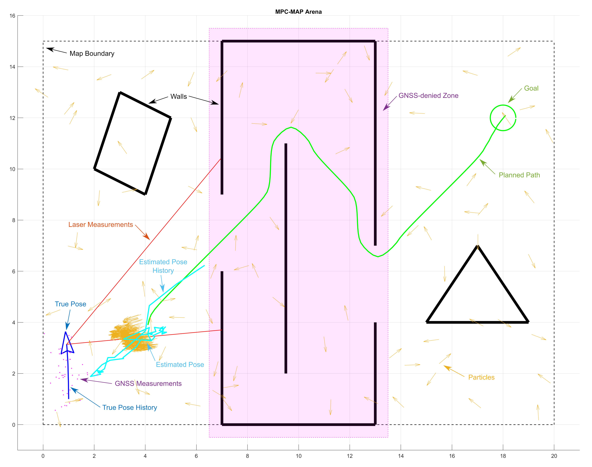

# MATLAB Robot Simulator

Simulátor je lehký nástroj v MATLABu pro testování klíčových algoritmů využívaných pro autonomní navigaci v mobilní robotice. Zahrnuje model mobilního robota s diferenciálním pohonem vybaveného dvěma různými senzory (lidar a GNSS) a umožňuje jej nasadit v uživatelských 2D mapách. Hlavním cílem je navigovat robota ze startovní do cílové pozice; z tohoto důvodu je třeba implementovat několik algoritmů:

- **Lokalizace**: jsou potřeba dva algoritmy – pro venkovní a vnitřní prostředí. Polohu lze odhadnout pomocí rozšířeného Kalmanova filtru a dat GNSS ve venkovních oblastech; pro vnitřní prostředí je vhodnější algoritmus využívající partiční filtr a známou mapu, protože vnitř je GNSS zóna bez signálu.
- **Plánování trasy**: algoritmus pro nalezení optimální trasy bez překážek ze startu do cíle (např. algoritmy A* a Dijkstra).
- **Řízení pohybu**: strategie řízení pro sledování vypočtené trasy pomocí aktuálně odhadnuté polohy. To vede k řídicím příkazům pro jednotlivá kola.

Simulátor byl testován v **MATLAB R2023b**; nemusí správně fungovat v jiných verzích.

## Proměnné

Simulátor používá řadu proměnných k zajištění své funkce; ne všechny z nich však lze použít/číst pro řešení úkolu (např. skutečná poloha robota). Proměnné jsou rozděleny do tří skupin (struktur):

- **Privátní proměnné** (`private_vars`): tyto proměnné se používají pouze ve skriptu *main* a **nejsou přístupné** v upravitelných studentských funkcích.
- **Proměnné pouze pro čtení** (`read_only_vars`): tyto jsou dostupné pro váš kód, ale **nevracejí se** do skriptu *main*.
- **Veřejné proměnné** (`public_vars`): můžete je libovolně používat a **měnit** a **přidávat nové položky** do struktury. Většina studentských funkcí vrací strukturu do skriptu *main*, takže ji můžete použít pro sdílení proměnných mezi funkcemi.

Kromě těchto struktur proměnných se ve vašem workspace může objevit i jiné proměnné, jejich použití není omezeno.

## Simulační smyčka

Workspace simulátoru obsahuje *main* skript uložený v `main.m`, který obsahuje hlavní logiku/smyčku simulátoru a používá se pro spuštění simulace (`F5` klávesa). Po inicializační části (očekává se, že upravíte soubor `setup.m`, který je volán na začátku) následuje nekonečná smyčka `while true` s následujícími kroky:

1. **Kontrola cíle**: ověření, zda byl cíl dosažen.
2. **Kontrola kolize**: ověření, zda robot nenarazil do stěny.
3. **Kontrola přítomnosti**: ověření, zda robot neopustil arénu.
4. **Kontrola částic**: ověření limitu částic.
5. **Měření lidarem**: načtení dat z lidaru a uložení do struktury `read_only_vars`.
6. **Měření GNSS**: načtení dat GNSS a uložení do struktury `read_only_vars`.
7. **Měření MoCap**: načtení referenční polohy z motion capture systému a uložení do struktury `read_only_vars`.  
8. **Inicializační procedura**: volá se pouze v první iteraci; slouží k inicializaci filtrů a dalším úlohám prováděným pouze jednou.
9. **Aktualizace partičního filtru**: upravuje množinu částic použitých ve vašem **partičním filtru**.
10. **Aktualizace Kalmanova filtru**: upravuje střední hodnotu a rozptyl použitý ve vašem **Kalmanově filtru**.
11. **Odhad polohy**: použijte výsledky filtrů k získání odhadu.
12. **Plánování trasy**: vrací výsledek vašeho **algoritmu plánování trasy**.
13. **Plánování pohybu**: vrací výsledek vašeho **algoritmu řízení pohybu**. Uložte výsledek do proměnné `motion_vector` (`[v_right, v_left]`).
14. **Pohyb robota**: fyzicky pohybuje robotem dle řídicí proměnné `motion_vector`.
15. **Renderování GUI**: vykreslí stav simulátoru ve Figure okně.
16. **Inkrementace čítače**: upraví proměnnou `read_only_vars.counter` pro zaznamenání počtu ukončených iterací.

Kroky 8 až 13 jsou umístěny ve funkci `algorithms/student_workspace.m`.

**Varování!** Krok 7 bude při hodnocení závěrečného projektu přeskočen. Vaše řešení se **nesmí** spoléhat na data MoCap!

Měli byste být schopni dokončit všechny úkoly bez úpravy souboru `main.m`.

## Uživatelské funkce

Je vítáno přidávání vlastních funkcí do složky *algorithms*; snažte se však dodržovat navrženou strukturu (např. umístěte související funkce Kalmanova filtru do složky *kalman_filter*). Můžete také libovolně upravit obsah (**nikoli hlavičky**) funkce *student_workspace* (kroky 8 až 13 simulační smyčky) a další funkce, které volá.  

## Mapy a testování

Adresář `maps` obsahuje několik map ve formátu textových souborů, které jsou při spuštění simulace parsovány za běhu. Použijte reverzní inženýrství k pochopení syntaxe a vytvořte vlastní mapy pro důkladné testování algoritmů. Obecně syntax zahrnuje definici pozice cíle, rozměrů mapy, pozic stěn a polygonů bez GNSS signálu. Nezapomeňte testovat i různé startovní polohy (včetně úhlu), které lze nastavit pomocí proměnné `start_position` (`setup.m`). Pro hodnocení projektu bude použita komplexní mapa zahrnující jak vnitřní, tak vnější oblasti a zóny bez GNSS signálu.

## GUI

